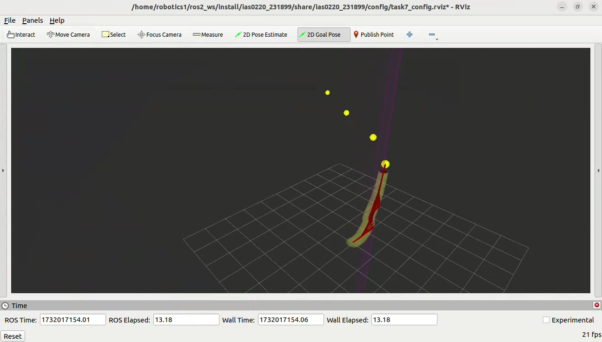
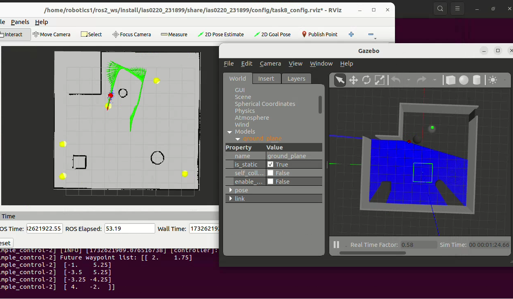

# Introduction
Repository for my turtlebot project during master's studies.
Branches are for each stage of the project. Main branch is the most up-to-date with the code that can be simulated.
Utilizes rospy libraries for navigation and standard Python libraries for odometry calculations. In addition, OpenCV2 libraries for object recognition and camera calibration.

# Usage
Requires a ROS2 installation, preferably Humble as that is the release this project was built on.
This also needs a gazebo installation to access physics simulation. Run the python script using rosrun.

# Example videos

